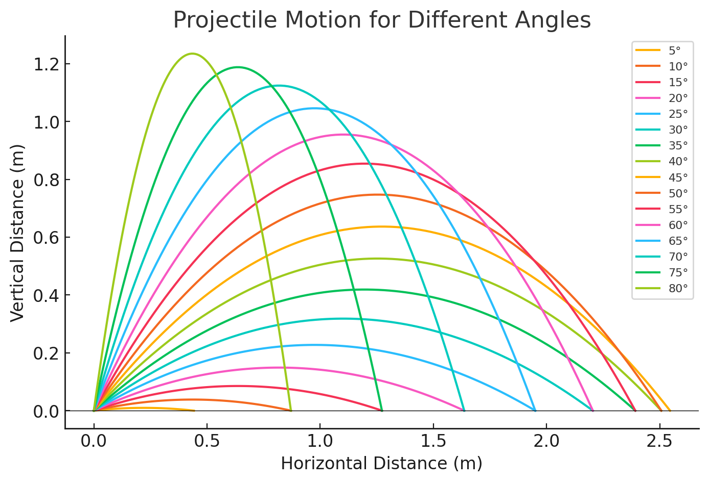

# 📌 Exercise 3: Projectile Motion Analysis

## **1️⃣ Understanding the Parameters**
The motion of a projectile is determined by several key parameters.

### **1.1 Parameters and Usage**
| Parameter | Symbol | Meaning | Type | Used In |
|-----------|--------|---------|------|---------|
| **Initial velocity** | v₀ | Speed at which the projectile is launched | **Double (m/s)** | ✅ **Code** (`v0` in `throw_parabola_main.cpp`) |
| **Launch angle** | α | The angle at which the projectile is fired | **Double (degrees)** | ✅ **Code** (`theta` in `throw_parabola_main.cpp`) |
| **Gravitational acceleration** | g | Constant acceleration due to gravity | **Double (m/s²)** | ✅ **Code** (`g` in `throw_parabola_main.cpp`) |
| **Horizontal Position** | x | Distance traveled along the ground | **Double (meters)** | ✅ **Code** (`x` in `throw_parabola_main.cpp`) |
| **Vertical Position** | y | Height of the projectile at given `x` | **Double (meters)** | ✅ **Code (return value)** (`y` in `calculateVerticalDistance()`) |
| **Time of Flight** | tₓ | Total time the projectile stays in air | **Double (seconds)** | ❌ **Only used in math** |
| **Maximum Height** | hₘₐₓ | Highest point reached in trajectory | **Double (meters)** | ❌ **Only used in math** |
| **Range** | R | Total horizontal distance before impact | **Double (meters)** | ❌ **Only used in math** |

---

## **2️⃣ Equations Used in Physics**
Now, we present the key equations:

### **2.1 Motion Formulas**
### **Gravitational Acceleration**
$$
g = 9.82 \frac{m}{s^2}
$$

### **Horizontal Position**
$$
x = v₀ \cos(α) t
$$

### **Vertical Position**
$$
y = v₀ \sin(α) t - \frac{1}{2} g t^2
$$

### **Time of Flight**
$$
tₓ = \frac{2 v₀ \sin(α)}{g}
$$

### **Maximum Height**
$$
hₘₐₓ = \frac{(v₀ \sin(α))^2}{2g}
$$

### **Range**
$$
R = \frac{v₀^2 \sin(2α)}{g}
$$

---

## **3️⃣ Function to Calculate Vertical Height at a Given `x`**
To compute the vertical height **y** at a given horizontal position **x**, we implemented the function:

### **3.1 Equation Used in the Function**
The equation used to calculate the vertical position \( y \) of a projectile at a given horizontal distance \( x \) is:

$$
y = x \tan(α) - \frac{g x^2}{2 v₀^2 \cos^2(α)}
$$

#### **Derivation of the Equation for Vertical Height `y`**
To find the vertical position \( y \) at a given horizontal position \( x \), we use the fundamental equations of projectile motion.

#### **Step 1: Position Equations for Motion**
The general motion equations for horizontal and vertical positions as functions of time \( t \) are:

$$
x = v_0 \cos(α) t
$$

$$
y = v_0 \sin(α) t - \frac{1}{2} g t^2
$$

#### **Step 2: Express Time `t` in Terms of `x`**
Rearranging the horizontal position equation for \( t \):

$$
t = \frac{x}{v_0 \cos(α)}
$$

#### **Step 3: Substitute `t` into the Vertical Position Equation**
Replacing \( t \) in the vertical position equation:

$$
y = v_0 \sin(α) \left(\frac{x}{v_0 \cos(α)}\right) - \frac{1}{2} g \left(\frac{x}{v_0 \cos(α)}\right)^2
$$

#### **Step 4: Simplify the Equation**
$$
y = x \tan(α) - \frac{g x^2}{2 v_0^2 \cos^2(α)}
$$

This final equation describes the vertical position \( y \) at a given horizontal distance \( x \), given:
- \( x \) = horizontal distance (meters)
- \( y \) = vertical height (meters)
- \( α \) = launch angle (degrees)
- \( g \) = 9.82  m/s² (gravity)
- \( v₀ \) = initial velocity (m/s)

This formula is implemented in our C++ function `calculateVerticalDistance()` to determine projectile motion height at a given `x`.

---

## **4️⃣ C++ Implementation**
### **4.1 Function Prototype (`throw_parabola.h`)**
```cpp
#ifndef THROW_PARABOLA_H  // Include guard
#define THROW_PARABOLA_H

/**
 * Calculates the vertical distance (y) of a projectile at a given horizontal distance (x).
 *
 * @param v0     Initial velocity of the projectile (m/s)
 * @param theta  Launch angle in degrees
 * @param g      Acceleration due to gravity (m/s²)
 * @param x      Horizontal distance from the launch point (m)
 * @return       Vertical distance (y) at the given horizontal position
 */
double calculateVerticalDistance(double v0, double theta, double g, double x);

#endif // THROW_PARABOLA_H
```

### **4.2 Function Implementation (`throw_parabola.cpp`)**
```cpp
#define _USE_MATH_DEFINES
#include "throw_parabola.h"
#include <cmath>  // Needed for trigonometric functions

double calculateVerticalDistance(double v0, double theta, double g, double x) {
    double theta_rad = theta * M_PI / 180.0;  // Convert degrees to radians
    return x * tan(theta_rad) - (g * x * x) / (2 * v0 * v0 * cos(theta_rad) * cos(theta_rad));
}
```

### **4.3 Main Program (`throw_parabola_main.cpp`)**
```cpp
#include <iostream>
#include "throw_parabola.h"

using namespace std;

int main() {
    // Display program purpose
    cout << "Projectile Motion Calculator\n";
    cout << "--------------------------------\n";
    cout << "This program calculates the vertical position (y) \n";
    cout << "of a projectile at a given horizontal distance (x).\n";
    cout << "--------------------------------\n\n";

    // Define parameters
    double v0 = 5.0;       // Start speed (m/s)
    double theta = 45.0;   // Angle (degrees)
    double g = 9.82;       // Gravity (m/s²)
    double x = 1.4;        // Horizontal distance (m)

    // Call function
    double y = calculateVerticalDistance(v0, theta, g, x);
    
    // Display results with explanation
    cout << "Input Parameters:\n";
    cout << "   - Initial Speed (v0): " << v0 << " m/s\n";
    cout << "   - Launch Angle (theta): " << theta << " degrees\n";
    cout << "   - Gravity (g): " << g << " m/s²\n";
    cout << "   - Horizontal Distance (x): " << x << " m\n\n";

    cout << "Result:\n";
    cout << "   - Vertical Height at x = " << x << " m: " << y << " m" << endl; // Newline + forces buffer flush

    return 0;
}
```

---

## **5️⃣ Graph: Projectile Motion for Different Angles**
The following graph shows projectile trajectories for different launch angles, varying from **5°** to **80°** in steps of **5°**:



---

## **6️⃣ Compilation & Execution**
### **6.1 Compile with g++**
If using **g++**, run the following command:
```sh
g++ throw_parabola_main.cpp throw_parabola.cpp -o throw_parabola_main.exe
./throw_parabola_main.exe
```

---

## **7️⃣ Insights from the Graph**
- **Lower angles (5°-30°)** → Longer horizontal range but lower height.
- **Mid-range angles (45°)** → Maximum range.
- **Higher angles (60°-80°)** → Higher peaks but shorter horizontal range.
- **All trajectories follow a parabolic path** due to gravity.

📌 **Using the function `calculateVerticalDistance()`, we verified that the results match the expected trajectory.**  
📌 **If `x` is too large, `y` becomes negative, meaning the projectile has already landed.**  

---